
<h1 align="center">基于html的济南旅游网站+vue</h1>

## 简介
济南旅游网站：角色分为管理员、用户；功能包括首页、景区介绍、疫情风险、游玩攻略、旅游资讯管理、用户和景区管理、评论和收藏、轮播图上传与管理。    --计算机毕业设计源码；毕设源码；java毕业设计源码

## 联系方式

<h3 align="center">获取完整代码与数据库文件 + 微信：deepguan QQ: 86050149 QQ群: 783742310</h3>

<h3 align="center">可帮忙远程部署 包运行成功！提供远程部署、修改代码、设计文档指导、代码讲解等服务！</h3>

## 功能介绍（完整见运行截图）
管理员： 支持登录和登出功能；访问主页时，提供景区介绍、疫情风险信息、旅游资讯和其他网站导航。主要负责后台管理，包括管理和编辑景区信息、旅游攻略、用户信息以及疫情资讯等；可查看、添加、修改和删除景区信息和旅游资讯，在旅游资讯和景区信息模块进行搜索；通过后台管理界面上传和配置首页轮播图、编辑和管理游玩攻略，并能输入和管理公司信息和联系方式。

用户： 可以登录和退出账户，主页上能够浏览景区介绍、游玩攻略及疫情相关信息；个人中心页面允许查看和修改个人信息，如账号、密码、姓名等，同时支持更新信息和退出登录。用户能够通过网站主页或搜索功能查看景区的详细信息，参与评论和查看他人评论。用户还可在游玩攻略模块浏览和搜索不同景区的旅游信息，并管理个人收藏。

## 运行截图
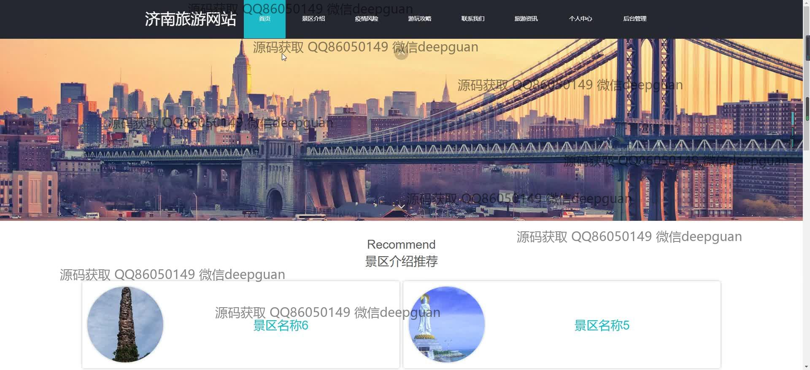
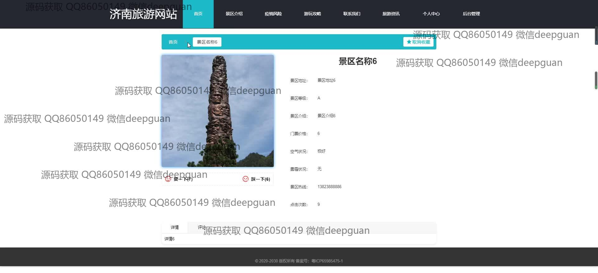
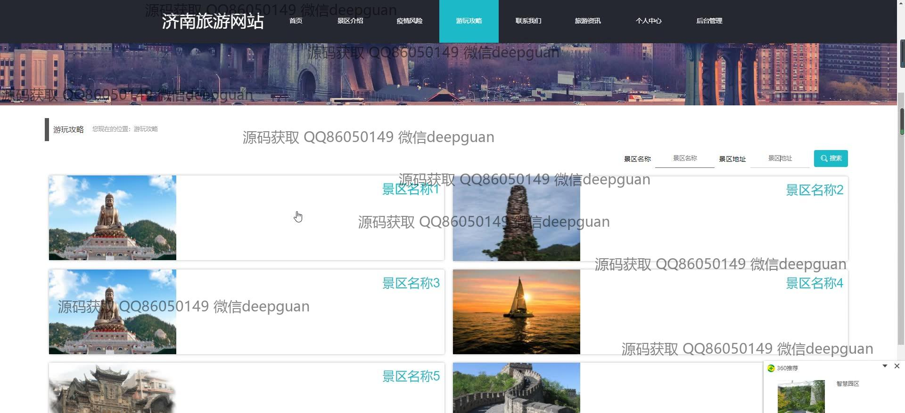
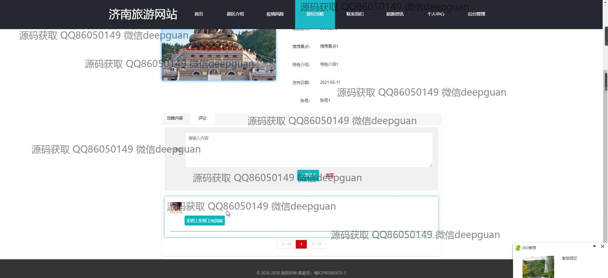
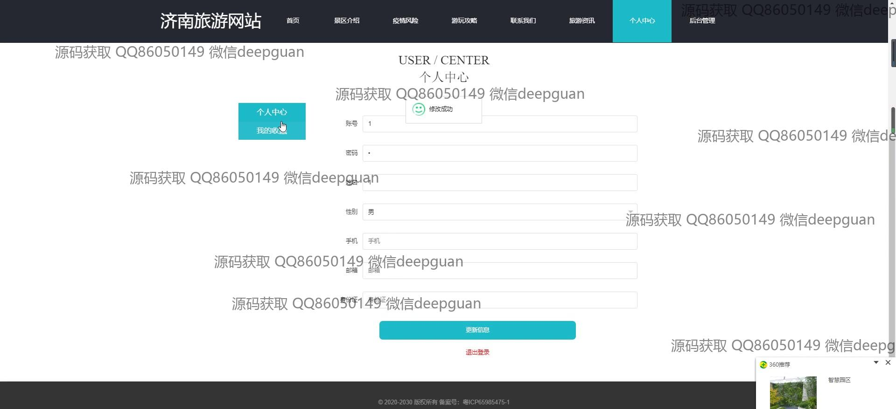
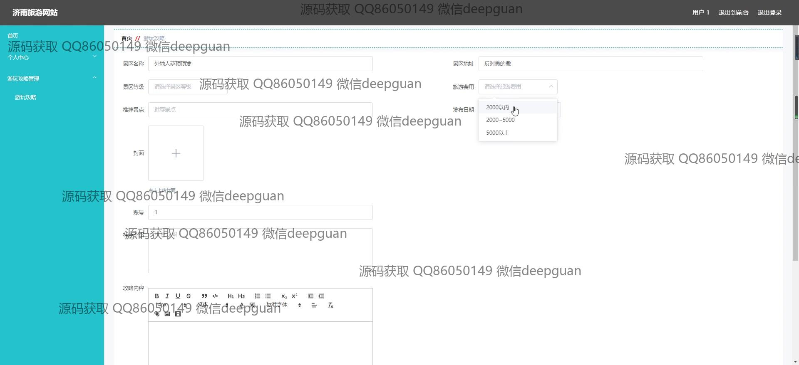
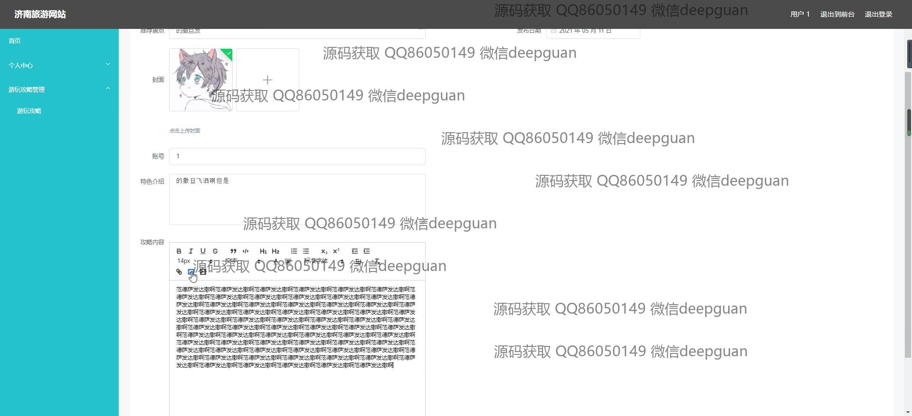
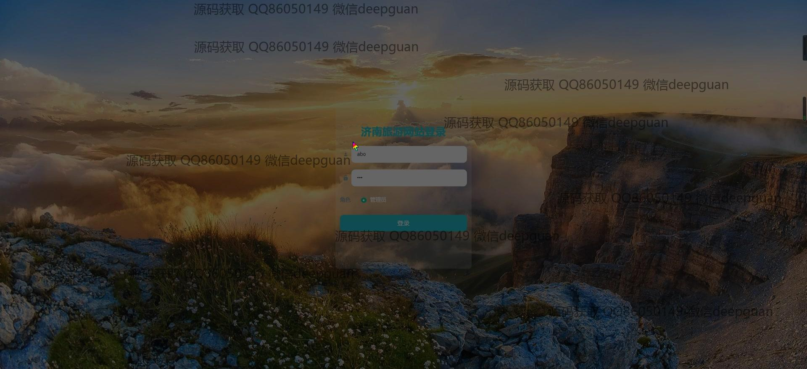
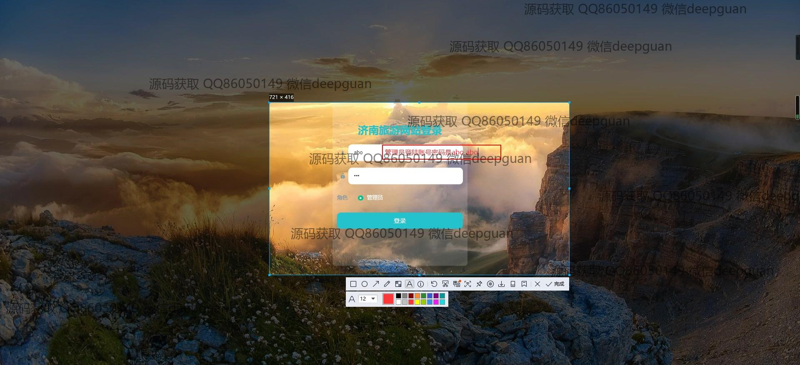
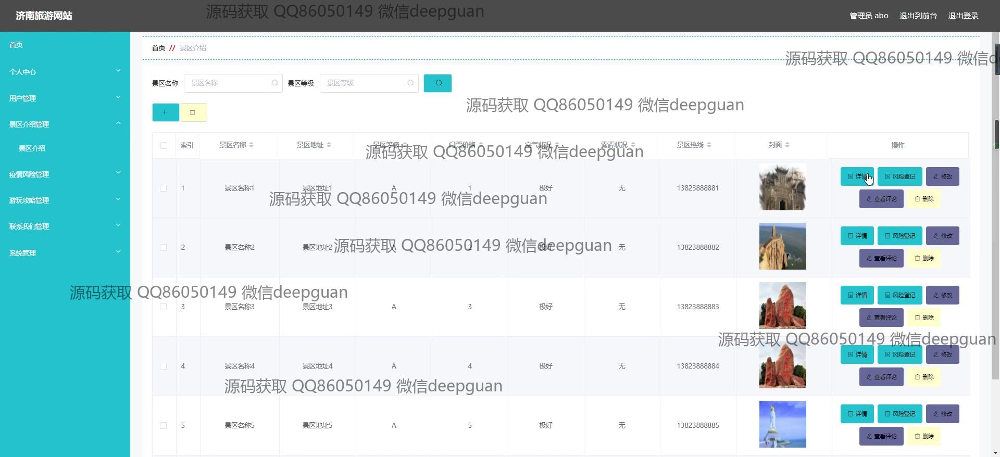
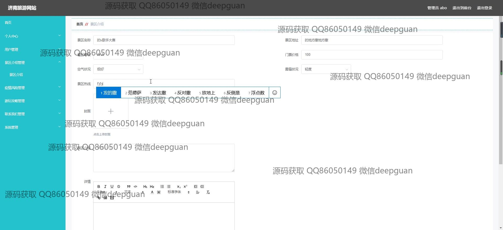

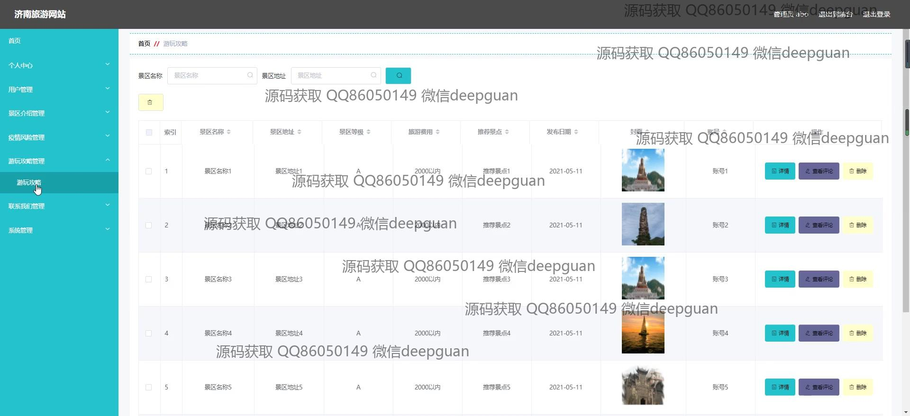
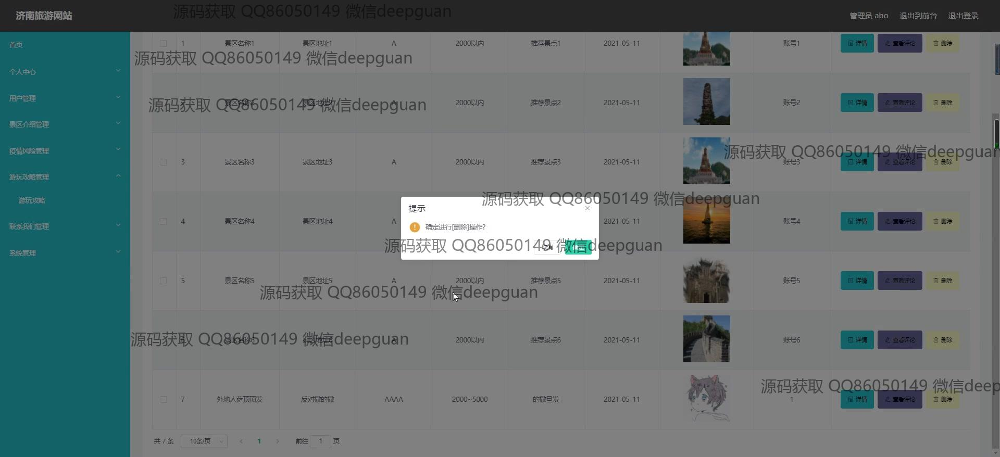
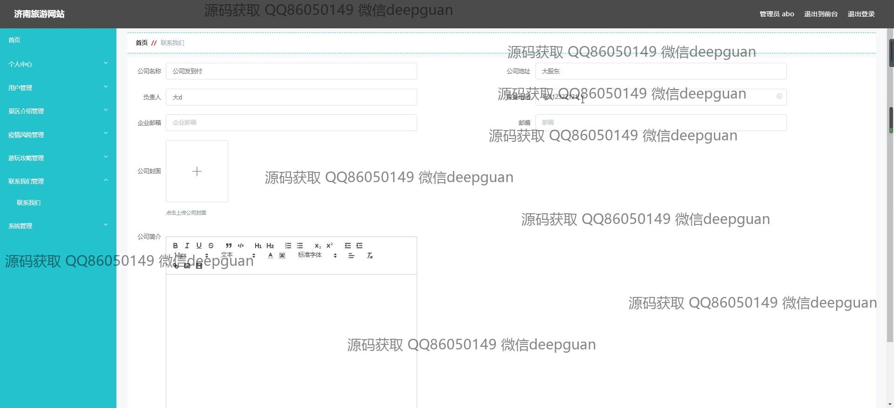
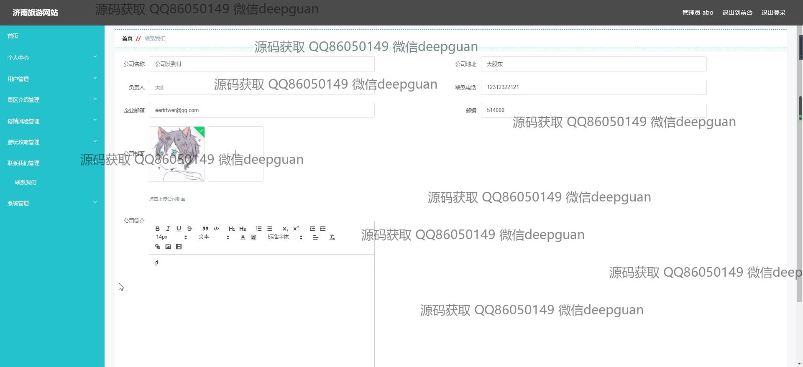
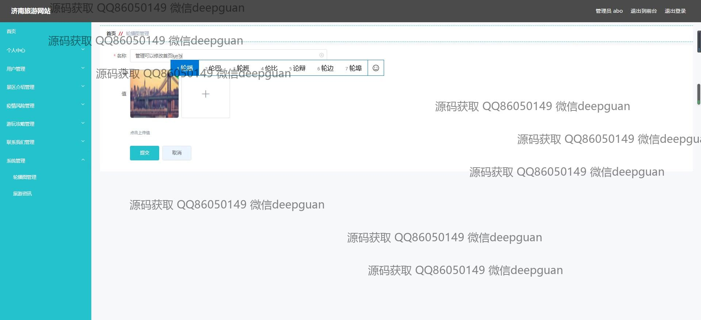
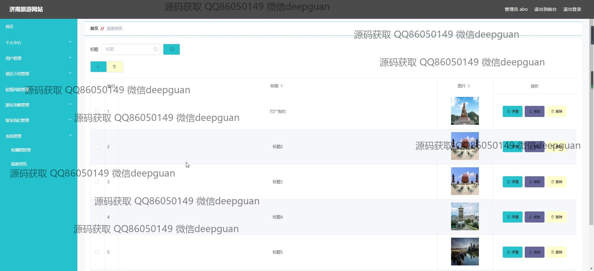

本代码来源于网络,仅供学习参考使用!

